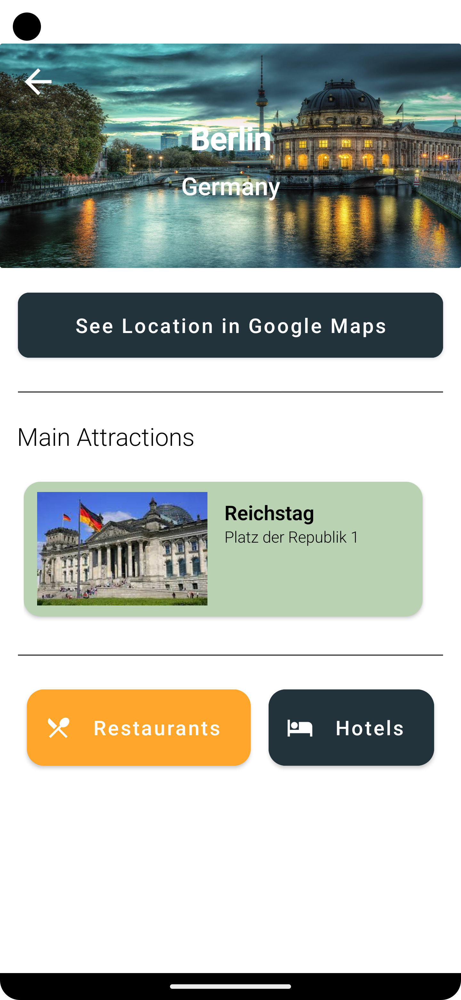

# TravelApp

## Table of contents
* [Introduction](#introduction)
* [Technologies](#technologies)
* [Illustrations](#illustrations)

## Introduction
    Travel Guide is a simple Android application that helps users to plan an unforgettable trip to 
    many cities in Germany. Here you can find the perfect hotel for your company, interesting 
    attractions, deliciouse food and more! App allows to create a checklist with destinations 
    you'd like to visit while traveling and useful maps for every city.
    
## Technologies
* Java 17
* Android Studio
* Lottie Animations
* Firebase Authentication

## Illustrations
|  Homepage         |       Splash  |
| ------------------ | --------------- |
|| |

| City Page             |         Checklist  |
| ------------------ | --------------- |
|  |  |
